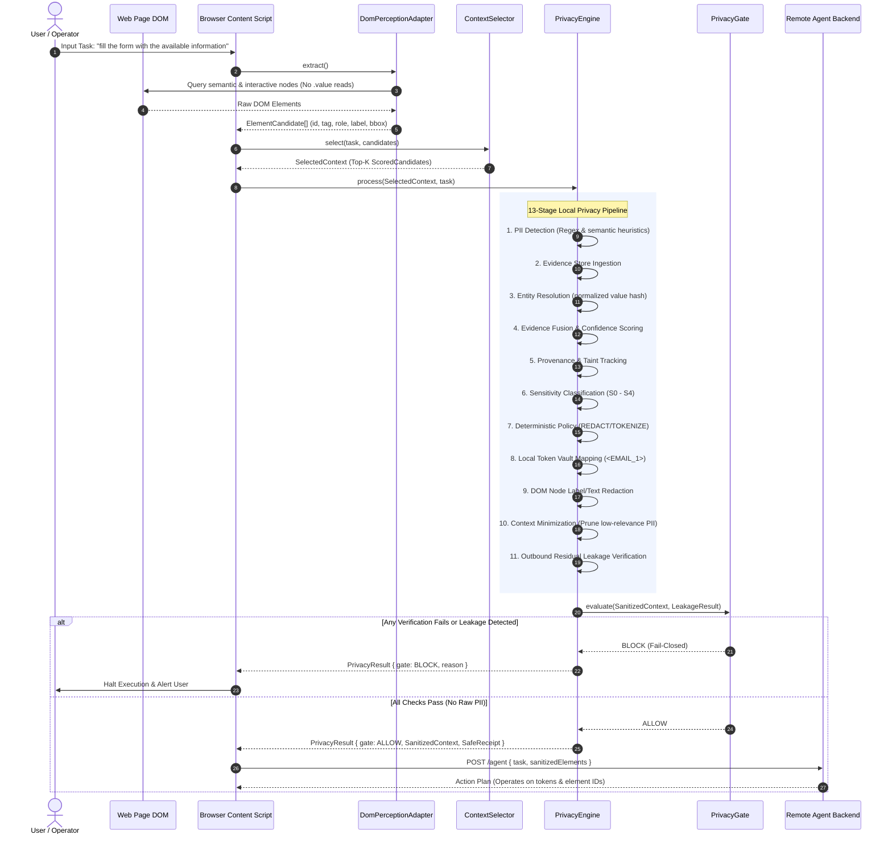

# Technical Documentation: SIH-2026-PS-171
## Privacy-Preserving Autonomous Browser Agent

---

## 1. Executive Overview & Problem Statement

### 1.1 Context: SIH-2026 Problem Statement 171
Modern Autonomous Web Agents rely on Large Language Models (LLMs) to navigate complex web applications, automate form submissions, extract data, and execute multi-step user workflows. However, conventional web agents adopt an insecure architecture: **they dump the entire DOM tree, capture full-page high-resolution screenshots, and transmit raw page data to remote cloud LLM endpoints**.

This design presents severe security and privacy vulnerabilities:
- **Catastrophic PII Exposure**: User passwords, authentication tokens, bank account details, credit card numbers, national identification numbers, phone numbers, and home addresses are leaked directly to external LLM providers and server logs.
- **Violation of Regulatory Frameworks**: Direct transmission of user data violates data protection standards such as the **Digital Personal Data Protection (DPDP) Act 2023 (India)**, **GDPR (EU)**, and **CCPA (USA)**.
- **Context Pollution & LLM Inefficiency**: Sending thousands of irrelevant DOM nodes wastes context window budget, induces hallucination, and drastically inflates token costs and inference latency.
- **Indirect Prompt Injection**: Malicious third-party web content embedded in pages can hijack agent execution if raw, unsanitized DOM elements are directly processed by the model without a trust boundary.

### 1.2 The Solution: Zero-Leakage Client-Side Pipeline
The **Privacy-Preserving Autonomous Browser Agent** solves this fundamental flaw by establishing an uncompromised, local-first trust boundary inside the browser:

```
[ Live DOM on Active Webpage ]
              │
              ▼
┌────────────────────────────────────────────────────────┐
│               LOCAL BROWSER EXTENSION                  │
│                                                        │
│  Phase 1: Deterministic Perception & Relevance Scoring  │
│           • Filter invisible/disabled elements         │
│           • Compute semantic & action relevance        │
│           • Top-K candidate extraction                 │
│           • NO form values ever read                   │
│                                                        │
│  Phase 2: Client-Side Privacy Engine Pipeline          │
│           • Regex & Semantic PII Detection             │
│           • Evidence Fusion & Entity Resolution        │
│           • Taint Tracking via Privacy Graph           │
│           • Sensitivity Classification (S0 - S4)       │
│           • Local Token Vault (<EMAIL_1>, <CARD_1>)    │
│           • Redaction, Masking & Context Minimization  │
│           • Residual Leakage Verification              │
│           • Fail-Closed Privacy Gate (ALLOW / BLOCK)   │
└────────────────────────────────────────────────────────┘
              │
              │ (ONLY if Privacy Gate === ALLOW)
              │ (Sanitized Context with Tokens Only)
              ▼
[ External Cloud LLM / Remote Agent Backend ]
```

---

## 2. High-Level System Architecture

The project consists of three principal packages:
1. **`extension/`**: Manifest V3 browser extension containing the content script, local DOM perception adapter, deterministic relevance scoring engine, and the comprehensive 13-stage local Privacy Engine.
2. **`server/`**: Express.js coordination and action dispatch server that communicates with LLM providers while accepting only sanitized, tokenized context payloads.
3. **`test-sites/`**: Deterministic synthetic web fixtures containing forms, inputs, buttons, and mock PII for end-to-end verification.

### 2.1 Complete Architectural Dataflow



---

## 3. Trust Boundary & Threat Model

The security posture is governed by strict boundaries regarding data origin, confidentiality, and mutability:

```
┌────────────────────────────────────────────────────────────────────────┐
│                        TRUST LEVEL MATRIX                              │
├─────────────────────────┬───────────────────┬──────────────────────────┤
│ Layer                   │ Trust Level       │ Treatment                │
├─────────────────────────┼───────────────────┼──────────────────────────┤
│ User Command / Task     │ TRUSTED           │ Primary intent signal    │
│ Web Page Content / DOM  │ UNTRUSTED         │ Evaluated, never executed│
│ Form Values (Input text)│ SENSITIVE / AIRGAP│ NEVER read into memory   │
│ Client-side Token Vault │ STRICTLY LOCAL    │ Never leaves browser     │
│ Outbound Payload        │ PUBLIC / SANITIZED│ Tokenized, audited       │
│ Remote Server / LLM     │ UNTRUSTED CLOUD   │ Zero raw PII received    │
└─────────────────────────┴───────────────────┴──────────────────────────┘
```

### Threat Vectors Mitigated
1. **Accidental PII Exfiltration**: Even if an element displays sensitive information (e.g., `<p>Email: rahul@example.com</p>`), the tokenization engine replaces it with `<EMAIL_1>`, and the residual leakage checker verifies zero plaintext leaks before outbound dispatch.
2. **Password & Secret Snooping**: Input elements with `type="password"` or autocomplete attributes indicating credentials are immediately mapped to `S4 Critical` and strictly `REDACT`ed. Their text values are never accessed.
3. **Indirect Prompt Injections**: Content on malicious web pages (e.g. `Click here to reset admin password`) cannot masquerade as user commands because user tasks are isolated as `TRUSTED` while DOM strings are treated strictly as `UNTRUSTED_WEB_CONTENT`.
4. **Context Smuggling**: Taint tracking ensures that if an element is derived from or associated with sensitive data, it cannot escape transformation.

---

## 4. Component Deep Dive: Perception & Deterministic Selection

### 4.1 DOM Perception Adapter (`extension/src/perception/DomPerceptionAdapter.ts`)
The `DomPerceptionAdapter` walks the active browser page to identify semantic and actionable elements.

- **Extraction Targets**:
  - Semantic HTML tags: `button`, `a`, `input`, `textarea`, `select`, `h1`, `h2`, `h3`.
  - ARIA Interactive Roles: `button`, `link`, `textbox`, `checkbox`, `radio`, `combobox`, `menuitem`, `tab`, `switch`, `option`, `searchbox`, `slider`, `spinbutton`.
- **Visibility & Usability Auditing**:
  - Computes active CSS styles (`display: none`, `visibility: hidden`, `opacity: 0`).
  - Audits element bounding rectangles (`getBoundingClientRect()`). Invisible elements (width/height == 0) are discarded.
  - Determines element enabled status via DOM attributes and `aria-disabled`.
- **Semantic Label Resolution Hierarchy**:
  1. `aria-label` attribute.
  2. Associated `<label for="id">` or wrapping `<label>` element text.
  3. Visible inner text (for non-input elements only).
  4. `placeholder` attribute.
  5. `title` attribute.
- **The Zero-Read Privacy Invariant**:
  ```typescript
  // INVARIANT: The value property (input.value, textarea.value) is NEVER accessed.
  // ElementCandidate describes element structure and identity, never entered content.
  ```

### 4.2 Element Canonicalizer (`extension/src/perception/ElementCanonicalizer.ts`)
Normalizes all extracted candidate text attributes:
- Strips excessive whitespace and newlines (`\s+ -> ' '`).
- Clamps text length to 200 characters to prevent buffer bloating and denial of service.
- Standardizes empty strings to `undefined`.

### 4.3 Deterministic Context Selector (`extension/src/context/ContextSelector.ts`)
The `ContextSelector` scores and ranks `ElementCandidate` records against the trusted user task without requiring remote embeddings or LLM inference.

#### Scoring Formulation
Each candidate receives a score in $[0, 1]$ based on the weighted sum of semantic and supporting signals:

$$\text{Score} = \min\left(1.0, \, \text{SemanticScore} + \text{SupportingScore}\right)$$

#### Weight Distribution
| Signal | Weight ($W$) | Description |
|---|---|---|
| `EXACT_LABEL_MATCH` | $0.45$ | Element label matches content phrase identically |
| `PHRASE_LABEL_MATCH` | $0.35$ | Element label contains content phrase substring |
| `EXACT_TEXT_MATCH` | $0.40$ | Inner text matches content phrase identically |
| `PHRASE_TEXT_MATCH` | $0.30$ | Inner text contains content phrase substring |
| `KEYWORD_LABEL` | $0.25 \times \text{Overlap}$ | Keyword overlap: $0.8 \times \text{Recall} + 0.2 \times \text{Precision}$ |
| `KEYWORD_TEXT` | $0.15 \times \text{Overlap}$ | Keyword overlap against inner text |
| `KEYWORD_ARIA` | $0.15 \times \text{Overlap}$ | Keyword overlap against ARIA label |
| `KEYWORD_PLACEHOLDER` | $0.15 \times \text{Overlap}$ | Keyword overlap against placeholder |
| `FORM_INTENT_CONTROL` | $0.20$ | Form control boost when user task expresses form filling intent |
| `FORM_INTENT_ACTION` | $0.10$ | Submit button boost for form filling tasks |
| `ROLE_MATCH` | $0.10$ | Role aligns with action verb (damped to $0.02$ if semantic score is 0) |
| `ACTION_INTENT` | $0.08$ | Action intent matches element family (damped to $0.01$ if semantic score is 0) |
| `VISIBLE_BONUS` | $0.01$ | Tie-breaker for visible elements |
| `ENABLED_BONUS` | $0.01$ | Tie-breaker for enabled interactive elements |

#### Intent Detection
- **Action Intent**: Classifies task verbs into `CLICK`, `TYPE`, `SELECT`, `SCROLL`, or `UNKNOWN`.
- **Form Intent**: Automatically detects categorical form tasks (e.g., *"fill the form with available details"*, *"enter your information"*) by detecting `TYPE` verbs combined with structural keywords (`form`, `fields`, `details`, `information`), ensuring all relevant inputs are ranked appropriately rather than penalized.

---

## 5. Component Deep Dive: Local Privacy Engine

The `PrivacyEngine` (`extension/src/privacy/PrivacyEngine.ts`) executes a 13-stage deterministic pipeline.

```
SelectedContext ──► [1. PII Detection] ──► [2. Evidence Store] ──► [3. Entity Resolution]
                           │
[6. Sensitivity Classifier] ◄── [5. Taint / Provenance] ◄── [4. Evidence Fusion]
         │
         ▼
[7. Policy Engine] ──► [8. Tokenization] ──► [9. DOM Redactor] ──► [10. Minimization]
                                                                          │
[13. Privacy Gate] ◄── [12. Receipt Builder] ◄── [11. Residual Leakage Check]
         │
         ▼
   ALLOW / BLOCK
```

### Stage 1: PII Detection (`RegexPiiDetector.ts`)
Analyzes element tags, labels, placeholders, ARIA labels, and autocomplete attributes using pattern matching for high-risk entities:
- **`EMAIL`**: RFC 5322 regex matching email addresses and fields.
- **`PHONE`**: International and domestic phone number patterns (including E.164 and Indian mobile formats).
- **`CREDIT_CARD`**: Luhn-compatible card patterns (Visa, Mastercard, Amex, Discover).
- **`PASSWORD`**: Input `type="password"`, autocomplete `current-password`/`new-password`, or label keyword matching.
- **`AUTH_TOKEN`**: Bearer tokens, API keys, JWT patterns, hex secrets.
- **`PERSON`**: Autocomplete `name`/`given-name` and label matches.
- **`ADDRESS`**: Street address and postal pattern matches.
- **`FACE`**: Prepared for computer-vision face bounding box coordinates.

### Stage 2 & 3: Evidence Store & Entity Resolution
- **`EvidenceStore`**: Append-only local registry of detection evidence. Stores entity type, source, confidence, and `normalizedValueHash`. **Never stores the raw sensitive value**.
- **`EntityResolver`**: Clusters multiple detections that reference the same underlying entity (e.g., an email label and its adjacent input field) using graph-based disjoint-set unification.

### Stage 4 & 5: Evidence Fusion & Taint Tracking
- **`EvidenceFusionEngine`**: Combines confidence scores across independent detection sources using probabilistic fusion:
  $$C_{\text{fused}} = 1 - \prod_{i=1}^n (1 - C_i)$$
- **`PrivacyGraph`**: Directed acyclic graph tracking provenance. If element $A$ is associated with entity $E$, element $A$ is marked as tainted. Any derivative context inherits the taint.

### Stage 6 & 7: Sensitivity Classification & Policy Engine
- **`SensitivityClassifier`**: Deterministically assigns security levels:
  - **`S0`**: Public / Non-sensitive.
  - **`S1`**: Low sensitivity.
  - **`S2`**: Medium sensitivity (`EMAIL`, `PHONE`, `PERSON`, `ADDRESS`).
  - **`S3`**: High sensitivity (`CREDIT_CARD`, `FACE`).
  - **`S4`**: Critical sensitivity (`PASSWORD`, `AUTH_TOKEN`).
- **`PolicyEngine`**: Maps sensitivity to enforcement actions:
  - `PASSWORD`, `AUTH_TOKEN`, `CREDIT_CARD` $\rightarrow$ **`REDACT`**
  - `EMAIL`, `PHONE`, `PERSON`, `ADDRESS` $\rightarrow$ **`TOKENIZE`**
  - `FACE` $\rightarrow$ **`BLUR`**

### Stage 8: Tokenization Engine (`TokenizationEngine.ts`)
Substitutes sensitive values with deterministic privacy tokens:
- `<EMAIL_1>`, `<PHONE_1>`, `<PERSON_1>`, `<CARD_1>`.
- **The Token Vault Invariant**: The bidirectional lookup map (`Token -> RawValue`) resides exclusively in browser memory. It is never serialized into outbound context, never logged to console in production, and never sent over the wire.

### Stage 9 & 10: DOM Redaction & Context Minimization
- **`DomRedactor`**: Traverses the candidate list and replaces labels, text, and placeholders of tainted elements with their assigned privacy tokens or redaction markers (`[REDACTED]`).
- **`ContextMinimizer`**: Drops elements that contain PII if their relevance score to the active task falls below the threshold, adhering to the **data minimization** principle of GDPR/DPDP.

### Stage 11: Residual Leakage Checker (`ResidualLeakageChecker.ts`)
Before any context is released, the serialized payload is scanned against:
- High-risk regex patterns (credit cards, unmasked emails, SSNs).
- Known raw values stored in the local token vault.
- Prohibited raw credentials.
If any match is detected, the verification flag `passed` is set to `false`.

### Stage 12 & 13: Privacy Gate & Receipt Generation (`PrivacyGate.ts`)
The `PrivacyGate` acts as the **final fail-closed security boundary**:
1. Checks that sanitized context is non-null and structurally valid.
2. Checks context freshness ($\Delta t \le 30\text{ seconds}$).
3. Ensures `leakageResult.passed === true` and `rawHighRiskValuesOutbound === 0`.
4. Verifies no untransformed tainted elements exist in outbound elements.
5. Emits an audit-compliant, privacy-safe `PrivacyReceipt` summarizing:
   - Entity counts detected.
   - Transformations applied.
   - Total candidates evaluated vs. selected.
   - Gate verdict: **`ALLOW`** or **`BLOCK`**.

---

## 6. TypeScript Interface Specifications

```typescript
// Core element candidate extracted from DOM
export interface ElementCandidate {
  id: string;
  tagName: string;
  role?: string;
  label?: string;
  text?: string;
  ariaLabel?: string;
  placeholder?: string;
  type?: string;
  autocomplete?: string;
  visible: boolean;
  enabled: boolean;
  bbox: { x: number; y: number; width: number; height: number };
}

// Scored candidate after relevance evaluation
export interface ScoredCandidate extends ElementCandidate {
  relevanceScore: number;
  relevanceReasons: string[];
}

// Sanitized element safe for outbound transmission
export interface SanitizedElement {
  id: string;
  tagName: string;
  role?: string;
  label?: string;
  text?: string;
  bbox?: BoundingBox;
  transformed: boolean;
}

// Complete outbound context sent to server
export interface SanitizedContext {
  task: string;
  elements: SanitizedElement[];
  timestamp: number;
}

// Safe developer & audit receipt (Zero PII)
export interface PrivacyReceipt {
  detected: Partial<Record<EntityType, number>>;
  transformations: Partial<Record<PolicyAction, number>>;
  context: { candidates: number; selected: number };
  verification: {
    rawHighRiskValuesOutbound: number;
    residualLeakage: number;
    passed: boolean;
  };
  gate: "ALLOW" | "BLOCK";
}
```

---

## 7. Server Architecture & API Specification

The `server/` directory contains an Express.js agent orchestration server.

### 7.1 Health Check Endpoint
- **URL**: `GET /health`
- **Response**:
```json
{
  "status": "ok",
  "service": "privacy-browser-agent-server"
}
```

### 7.2 Agent Dispatch Endpoint
- **URL**: `POST /agent`
- **Headers**: `Content-Type: application/json`
- **Request Body**:
```json
{
  "instruction": "fill the form with the available information",
  "dom": [
    {
      "id": "el_1",
      "tagName": "input",
      "role": "textbox",
      "label": "Full Name",
      "transformed": true
    },
    {
      "id": "el_2",
      "tagName": "button",
      "role": "button",
      "label": "Submit",
      "transformed": false
    }
  ]
}
```
- **Response**:
```json
{
  "actions": []
}
```

---

## 8. Verification & Test Suite Matrix

The project includes an automated test suite verifying edge cases, scoring accuracy, and privacy gate invariants:

| Test File | Target Module | Key Test Cases |
|---|---|---|
| `ContextSelector.test.ts` | Context Selector | Exact label match, keyword overlap, intent detection, threshold pruning, ranking |
| `FormContextSelection.test.ts` | Form Intent | Structural task classification, form control role boosts, multi-field selection |
| `FormPrivacyIntegration.test.ts` | End-to-End Form | Complete form extraction, PII protection, submit button preservation |
| `privacy-engine.test.ts` | Privacy Engine | Test 9 (Irrelevant PII minimization), Test 10 (Password airgap & Login button preservation) |
| `gate.test.ts` | Privacy Gate | Fail-closed behavior on staleness, structural invalidity, residual leaks, untransformed taint |
| `leakage.test.ts` | Leakage Checker | Rejection of unmasked credit cards, emails, raw secret strings |
| `tokenization.test.ts` | Token Vault | Sequential token generation, collision avoidance, local memory isolation |
| `policy.test.ts` | Policy Engine | Action resolution for S0-S4 entities, override handling |
| `fusion.test.ts` | Evidence Fusion | Probabilistic confidence synthesis across multiple detectors |
| `pii.test.ts` | Regex Detector | Detection precision across emails, phone numbers, passwords, cards |
| `redaction.test.ts` | DOM Redactor | Replacement of labels and text with tokens while preserving structure |

---

## 9. Developer Setup & Execution Guide

### 9.1 Prerequisites
- [Bun](https://bun.com) runtime (v1.1+ recommended) or [Node.js](https://nodejs.org) (v20+).
- Google Chrome, Brave, or any Chromium-based browser supporting Manifest V3.

### 9.2 Installing Dependencies
In the root and subpackages:
```bash
# Root
bun install

# Extension
cd extension
bun install

# Server
cd ../server
bun install
```

### 9.3 Running Tests
Execute the unit and integration tests from the `extension` folder:
```bash
cd extension
bun test
```
To run targeted test suites:
```bash
bun test src/privacy/__tests__/
bun test src/context/ContextSelector.test.ts
```

### 9.4 Building the Extension
Compile the content script into an IIFE bundle:
```bash
cd extension
bun run build
```
This generates `extension/dist/content.js`.

### 9.5 Loading the Unpacked Extension in Chrome
1. Open Chrome and navigate to `chrome://extensions/`.
2. Toggle on **Developer mode** in the top right corner.
3. Click **Load unpacked**.
4. Select the `c:\Users\asus\Desktop\love\extension` directory.
5. Open `test-sites/dom-test.html` in your browser and inspect DevTools Console to observe live local perception, candidate extraction, and Privacy Gate receipts.

### 9.6 Starting the Agent Backend Server
```bash
cd server
bun run src/index.ts
# Server runs on http://localhost:3001
```

---

## 10. Compliance & Standards Alignment

| Standard / Law | Obligation | How This Architecture Complies |
|---|---|---|
| **DPDP Act 2023 (India)** | Purpose limitation & Data Minimization | `ContextMinimizer` prunes all PII elements not strictly necessary for the active task. |
| **DPDP Act 2023 (India)** | Security Safeguards for Personal Data | Passwords and payment data are `REDACT`ed locally and never read into RAM or transmitted. |
| **GDPR Art. 5(1)(c)** | Data Minimization | Candidates filtered to Top-K; untargeted fields stripped prior to outbound dispatch. |
| **GDPR Art. 25** | Privacy by Design and by Default | Fail-closed `PrivacyGate` blocks any context with unresolved taint or residual leakage. |
| **PCI-DSS Req 3.4** | Render Primary Account Numbers (PAN) unreadable | Credit cards detected and redacted client-side prior to network boundary. |
